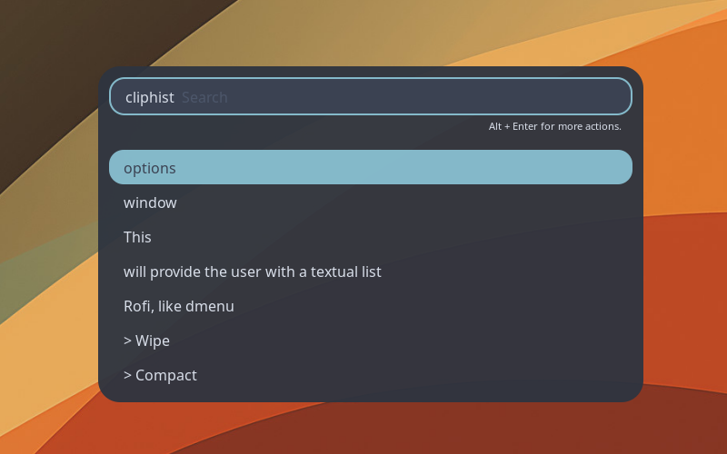

# rofiphist
`rofiphist.sh` is a small Bash launcher for browsing and managing
[`cliphist`](https://github.com/sentriz/cliphist) clipboard history through
[`rofi`](https://github.com/davatorium/rofi).

<p align="center">
  
</p>


## Usage

```sh
./rofiphist.sh

# Use a custom rofi theme:
./rofiphist.sh --theme /path/to/theme.rasi
```

## Demo

https://github.com/user-attachments/assets/6cd934e9-568c-4afd-bafb-cae50990c43d.mp4


## Requirements

- `rofi`
- `cliphist`
- `wl-copy` from `wl-clipboard`

## Use a key remapper to launch the script

### [xremap](https://github.com/xremap/xremap)

```yml
keymap:
 
  - name: Global Remaps
    remap:
      Shift-Alt-v:
        launch:
          - "bash"
          - "-c"
          - "/path/to/rofiphist.sh"
```

By default, the script uses `rounded-nord-dark.rasi` rofi theme from the same directory as
the script. This default theme comes from the
[rofi-themes-collection](https://github.com/newmanls/rofi-themes-collection)
project.
